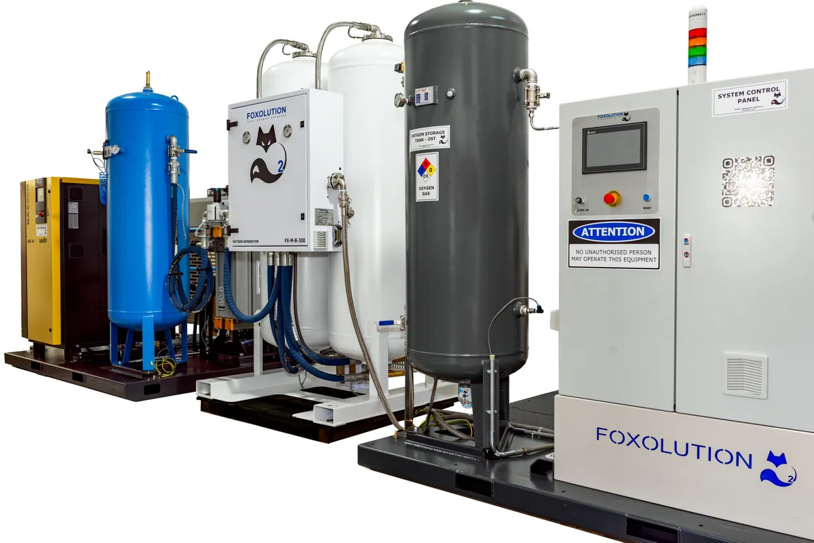

# Medware Solutions Ltd — Website

Static marketing site for Medware Solutions Ltd, a healthcare infrastructure development, biomedical engineering and healthcare ICT company based in Nairobi, Kenya.

Live at **https://www.medwaresol.com**. Plain HTML, CSS and JavaScript: no build step, no server-side code.

## Folder structure

```
.
├── index.html                    Homepage: hero, services summary, partner marquee, about, contact
├── services.html                 Service catalogue (#infrastructure, #biomedical, #ict)
├── products.html                 Product overview → the two product line pages
├── healthcare-ict.html           Healthcare ICT product line
├── medical-gas-systems.html      Medical Gas Systems product line
├── visocall-ip-nurse-call.html   Visocall IP nurse call devices (video + 12 components)
├── projects.html                 Completed projects by discipline (#infrastructure, #biomedical, #ict)
├── 404.html                      "Page not found" page (uses root-relative /paths)
│
├── assets/
│   ├── css/motion.css            Shared animations: hero entrance, scroll reveals, card hovers, menus
│   ├── js/motion.js              Mobile menu, scroll reveals, clickable cards, section sub-nav
│   └── images/
│       ├── brand/                Medware logo, homepage hero photo, share image, app icons
│       ├── services/             Photos for each service on services.html / homepage
│       ├── products/             Product line photos (nurse call, medical gas)
│       ├── projects/<project>/   Project gallery photos, e.g. projects/tenwek/tenwek-1.webp
│       ├── logos/                Partner and client logos (homepage marquee)
│       └── visocall/             Visocall device photos + the video thumbnail
│
├── favicon.ico                   Browser tab icon (must stay in the root)
├── robots.txt                    Allows all crawlers, points to the sitemap
├── sitemap.xml                   List of pages for search engines
├── .htaccess                     Apache/cPanel only: serves 404.html for missing pages
├── .gitattributes                Line-ending rules (text vs binary files)
└── .gitignore                    OS/editor files kept out of git
```

Page URLs live in the root on purpose: moving or renaming a page breaks existing links and search rankings.

## How the pages are built

- Each page is a self-contained HTML file with its CSS inline in a `<style>` block. The brand colours are CSS custom properties in `:root` (`--blue`, `--navy`, `--sky`, `--grey`, …), and the fonts are Montserrat and Inter from Google Fonts.
- The header, footer and design tokens are **repeated in every page**. A change to the nav, footer or colours has to be made in all 8 HTML files, `404.html` included.
- **Navigation:** Home, then Products / Services / Projects, each with a hover dropdown to its sub-pages or section anchors. Then Partners / About Us / Contact (sections of the homepage) and a "Request a consultation" button. At 760px wide and below, the dropdowns become an indented list.
- **Contact form:** it has no backend. Submitting opens the visitor's email app with a pre-filled message to `info@medwaresol.com`.
- **Visocall video:** the page shows a thumbnail (`images/visocall/video-poster.webp`), and the YouTube player only loads when the visitor clicks play.

## Search and sharing

Every page's `<head>` has, after the description:

- `<link rel="canonical">`: the page's full URL
- Open Graph and Twitter tags: title, description and `brand/og-image.jpg` (1200×630), for link previews on WhatsApp, LinkedIn, Facebook and X
- favicon and app icons, and `theme-color`

`index.html` also has a `LocalBusiness` JSON-LD block with the company name, address, phone numbers, email, map coordinates and service area. **Update it if any contact details change**; they also appear in the visible contact section.

## Common tasks

### Adding or replacing an image

1. **Resize before adding.** Photos straight from a phone are 3–5 MB, which is more than the whole rest of the site put together. Aim for:
   - photos: about **1200–1600 px** on the long side
   - logos: about **130 px** tall
2. **Save as WebP** at quality about 80 (e.g. with [Squoosh](https://squoosh.app)). Most images end up at 20–150 KB.
3. **Put it in the right folder**, named in lowercase-with-hyphens after what it shows (e.g. `services/oxygen-plant.webp`, `projects/tenwek/tenwek-5.webp`).
4. **Write the `` tag** with `alt` text, the image's real `width` and `height`, and `loading="lazy"` unless it's at the top of the page:

   ```html
   
   ```

   The width and height stop the page jumping while images load. CSS still controls the displayed size.

### Adding a page

1. Copy the closest existing page and change the `<title>`, meta description and content.
2. In the `<head>`, update the canonical URL, `og:title`, `og:description` and `og:url`.
3. Add the page to the nav in **every** page's header if it belongs there.
4. Add a `<url>` entry to `sitemap.xml`.

## Deployment

Upload the whole folder to any static web host (cPanel/Apache, GitHub Pages, Netlify, …). There's nothing to build.

- **Custom 404 page:** GitHub Pages and Netlify use `404.html` automatically. Apache/cPanel uses it through `.htaccess`.
- **After deploying:** check the link previews with LinkedIn's [Post Inspector](https://www.linkedin.com/post-inspector/) or Facebook's [Sharing Debugger](https://developers.facebook.com/tools/debug/), and submit `sitemap.xml` in Google Search Console.
